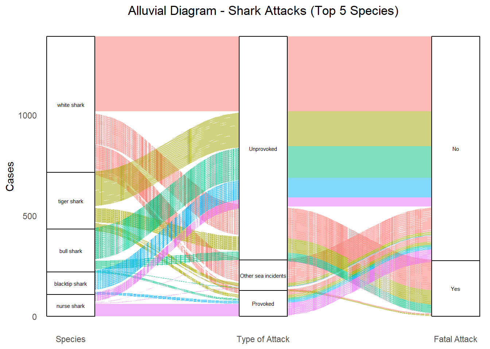
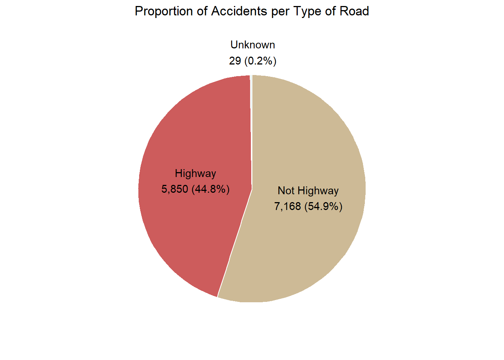
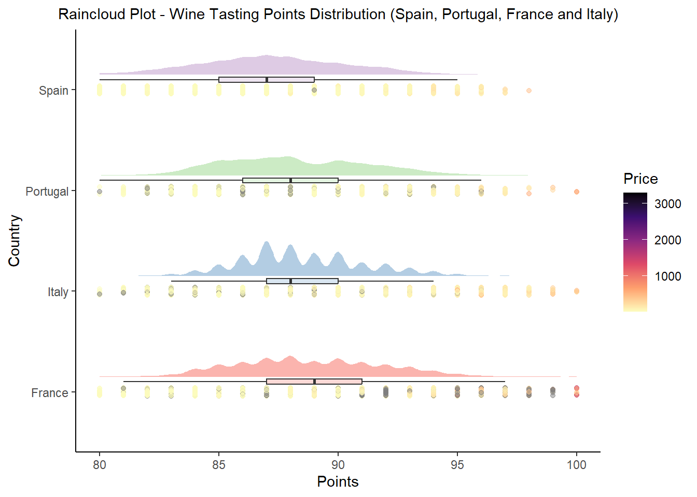

# PAC2 - Visualització de Dades | UOC Master en Ciència de Dades

Aquest repositori conté els arxius de codi R i els conjunts de dades necessaris per generar els gràfics, així com els resultats finals, per a la PAC2 de l'assignatura de Visualització de Dades.

## Contingut del repositori
- **src/**: Carpeta amb els scripts de codi R utilitzats per generar els gràfics i conjunts de dades en CSV.
- **output/**: Carpeta amb els resultats finals de l'execucció (fitxers HTML) i imatges generades.
- **README.Rmd**: Fitxer explicatiu sobre el contingut del repositori.

## Visualitzacions tractades
Aquest treball inclou les següents visualitzacions, i aquests són els seus resultats finals:
- **Alluvial Diagram**:

- **Pie Chart**

- **Rain Cloud Plot**

## Requisits
- Programari: R (versió 2024.12.0) i les llibreries necessàries (`dplyr`, `ggplot2`, `ggalluvial`, `ggrain`, entre altres).
